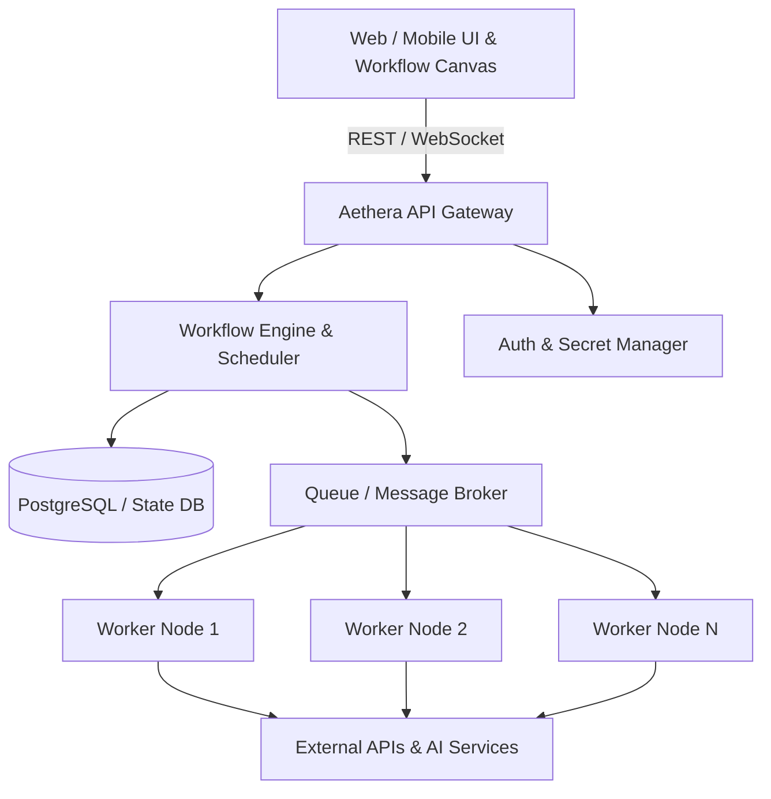

# 🌌 Aethera

<div align="center">


[](https://opensource.org/licenses/MIT)
[](#)
[](https://github.com/RukshanAmodya/Aethera/pulls)

<p align="center">
  <b>Aethera</b> is a next-generation, high-performance, and scalable <b>Full-Stack Workflow Automation & Integration Platform</b>.
  <br />
  Connect APIs, automate complex business logic, orchestrate AI agents, and streamline operations with an intuitive canvas and extensible architecture.
</p>

[Explore Features](#-key-features) •
[Architecture](#-architecture) •
[Getting Started](#-getting-started) •
[Roadmap](#-roadmap) •
[Contributing](#-contributing)

---

</div>

## 🌟 Overview

**Aethera** enables developers, teams, and enterprises to design, deploy, and monitor complex automated workflows seamlessly. Whether integrating multi-cloud services, coordinating multi-agent AI ecosystems, or orchestrating mission-critical backend pipelines, Aethera provides a robust, self-hosted, and cloud-ready automation engine.

---

## ⚡ Key Features

- 🎨 **Visual Workflow Designer**: Interactive node-based graph editor for rapid pipeline construction without boilerplate code.
- 🤖 **AI Agent Orchestration**: Native support for LLMs, autonomous agentic chains, tool calling, and RAG pipelines.
- 🔌 **Universal Integrations**: Hundreds of pre-built integrations with APIs, databases, webhooks, SaaS apps, and message queues.
- 🚀 **High-Throughput Execution Engine**: Distributed, event-driven runner capable of executing concurrent workflows with ultra-low latency.
- 🛡️ **Enterprise Security & Governance**: Role-based access control (RBAC), end-to-end secret encryption, and complete audit logging.
- 📊 **Real-time Observability**: Granular execution traces, error diagnostics, automated retries, and metric monitoring dashboards.
- 💻 **Developer First & Extensible**: Write custom nodes, script with JavaScript/TypeScript/Python, and deploy anywhere via Docker & Kubernetes.

---

## 🏗️ Architecture



---

## 🚀 Getting Started

### Prerequisites

- **Node.js**: `v20.x` or higher
- **pnpm**: `v9.x` or higher
- **Docker & Docker Compose** *(optional, for containerized deployment)*

### Installation

1. **Clone the repository:**
   ```bash
   git clone https://github.com/RukshanAmodya/Aethera.git
   cd Aethera
   ```

2. **Install dependencies:**
   ```bash
   pnpm install
   ```

3. **Set up environment variables:**
   ```bash
   cp .env.example .env
   ```

4. **Start development server:**
   ```bash
   pnpm dev
   ```

---

## 🗺️ Roadmap

- [x] Core Workflow Engine Architecture
- [x] Initial Integrations & Webhook Ingestion
- [ ] Visual Canvas UI Enhancements
- [ ] Agentic AI Tools & LLM Provider Connectors
- [ ] Distributed Multi-Worker Scaling
- [ ] Marketplace for Community Nodes & Templates

---

## 🤝 Contributing

Contributions make the open-source community an amazing place to learn, inspire, and create. Any contributions you make are **greatly appreciated**!

1. Fork the Project
2. Create your Feature Branch (`git checkout -b feature/AmazingFeature`)
3. Commit your Changes (`git commit -m 'feat: add amazing feature'`)
4. Push to the Branch (`git push origin feature/AmazingFeature`)
5. Open a Pull Request

---

## 📄 License

Distributed under the **MIT License**. See `LICENSE` for more information.

---

<div align="center">
  <sub>Built with ❤️ by <a href="https://github.com/RukshanAmodya">Rukshan Amodya</a> & the open-source community.</sub>
</div>
